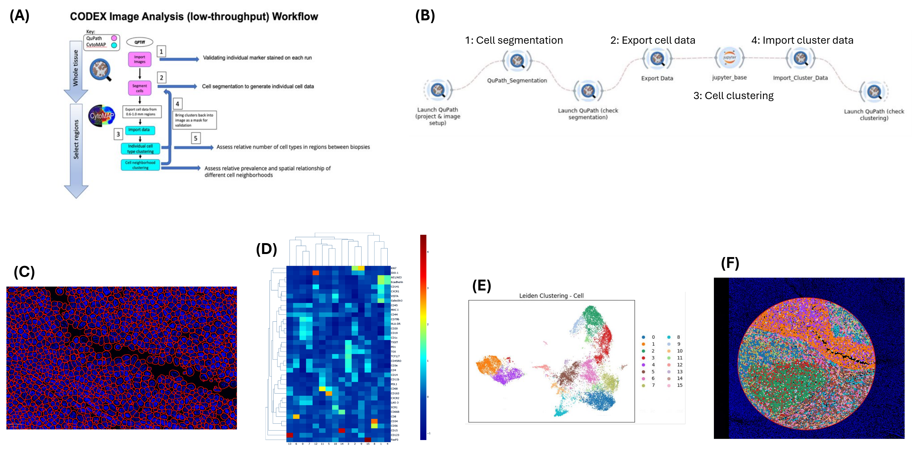

# Biodepot Spatial Proteomics

Scripts from the Biodepot spatial proteomics workflow. 

## Non-Bwb Software Requirements

Imaging visualization software is [QuPath](https://github.com/qupath/qupath)[1], this workflow uses [version 0.5.1](https://github.com/qupath/qupath/releases/tag/v0.5.1). In Bwb, QuPath is used to create QuPath projects, view and modify spatial images.

.groovy scripts require [Groovy](https://groovy-lang.org/) version >=2.4. Additional installation to install QuPath-related packages to Groovy are also required, obtained from [QuPath StarDist extension](https://github.com/qupath/qupath-extension-stardist)[2] version >=0.5.0.

[Jupyter Notebook](https://jupyter.org/) with Python 3 kernel is required.

## Steps and Analysis

### Set up QuPath project and image

Open QuPath and create a project. In the project, load an image to analyze. Set an annotation for the region in the image to segment and cluster.

### Cell segmentation

Run the [my_stardist.groovy](./scripts/my_stardist.groovy) script with its stardist model. Pixel size resolution from the source image needs to be provided into the script.

Outputs are segmented cells placed on the QuPath project image.

### Export segmentation data to CSV

Run the [export-all-cell-measurements_240829.groovy](./scripts/export-all-cell-measurements_240829.groovy) script to export the cell segmentation data from the image to a CSV file. Script modified from [Akoya Biosciences](https://github.com/lambrechtslab/Immunity-2024) version of StarDist segmentation.

### Cell clustering and plots via notebook

Use the [BWBQuPathClustering.ipynb](./scripts/BWBQuPathClustering.ipynb) notebook to use the exported segmentation data to perform unsupervised clustering of cell types using the Leiden algorithm and visualizing the clustering results as Uniform Manifold Approximation and Projections (UMAP) and heatmaps. 

### Import cell clustering data back onto QuPath

Run [import_clusters.groovy](./scripts/import_clusters.groovy) to import cell clustering data back into QuPath. Once finished, QuPath can show the cells with colormaps/masks on the image. Source of the script is inspired from an [image.sc post from Mike Nelson](https://forum.image.sc/t/there-and-back-again-qupath-cytomap-cluster-analysis/43352/2).

## Academic Citations

[1]
Bankhead, P. et al. QuPath: Open source software for digital pathology image analysis. Scientific Reports (2017).
https://doi.org/10.1038/s41598-017-17204-5

[2]
Uwe Schmidt, Martin Weigert, Coleman Broaddus, and Gene Myers.
Cell Detection with Star-convex Polygons.
International Conference on Medical Image Computing and Computer-Assisted Intervention (MICCAI), Granada, Spain, September 2018.