# Graphical and Interactive Spatial Proteomics Image Analysis Workflow

[](https://gitpod.io/#https://github.com/BioDepot/SpatialProteomics)

Pre-print: bioRxiv 2025.05.23.655879; [DOI](https://doi.org/10.1101/2025.05.23.655879)


Scripts from the Biodepot spatial proteomics workflow. 


## Software Requirements

Imaging visualization software is [QuPath](https://github.com/qupath/qupath)<sup>[1]</sup>, this workflow uses [version 0.5.1](https://github.com/qupath/qupath/releases/tag/v0.5.1). In our workflow, QuPath is used to create QuPath projects, view and modify spatial images.

.groovy scripts require [Groovy](https://groovy-lang.org/) version >=2.4. Additional installation to install QuPath-related packages to Groovy are also required, obtained from [QuPath StarDist extension](https://github.com/qupath/qupath-extension-stardist)<sup>[2]</sup> version >=0.5.0.

[Jupyter Notebook](https://jupyter.org/) with Python 3 kernel is required.

## Steps and Analysis

**NOTE:**

It is recommended to name QuPath projects, images, and annotations **without any spaces**. Use snake_case, kebab-case, or camelCase for names in the workflow. Otherwise, put names in "quotes" when entering names in widget entries.

### Set up QuPath project and image

Open QuPath and create a project. 

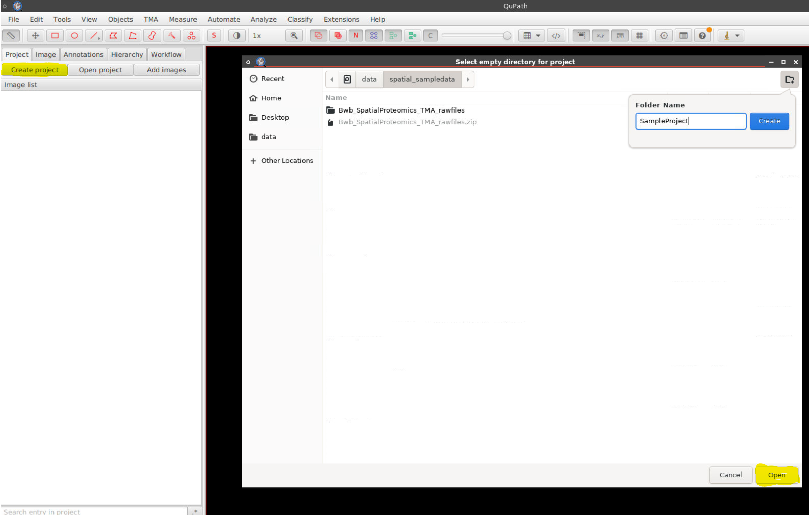

In the project, load an image to analyze. In the "Add images" popup, click "Choose files" to select the .tiff/.qptiff you want to analyze. For our sample image, the image type is "Fluorescence".

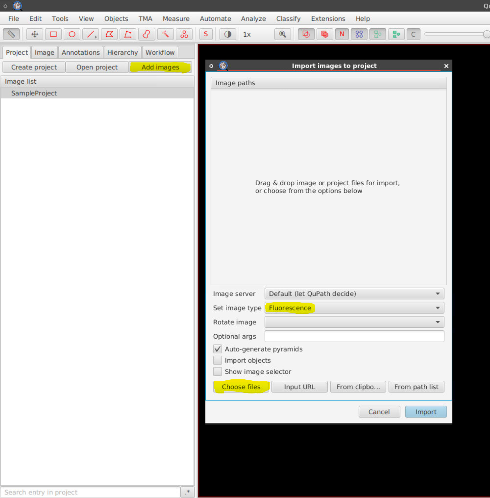

When importing an image to QuPath, the image name is the file name with " - resolution #1" appended. You can remove this appended section, or rename the image name for this image, to something else. **NOTE**: Changing the image name on QuPath does not change the actual file's name.

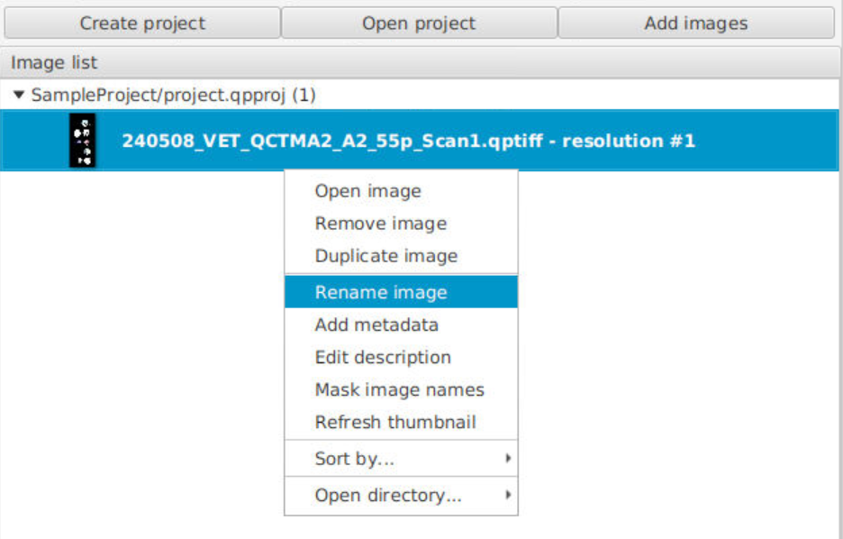

Set an annotation for the region in the image to segment and cluster. For an easy annotation option, select the circle button on the top-left section of the interface, and draw a circle on a core.

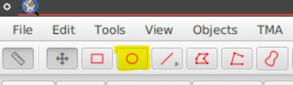

In the annotation's properties, give the annotation a name.

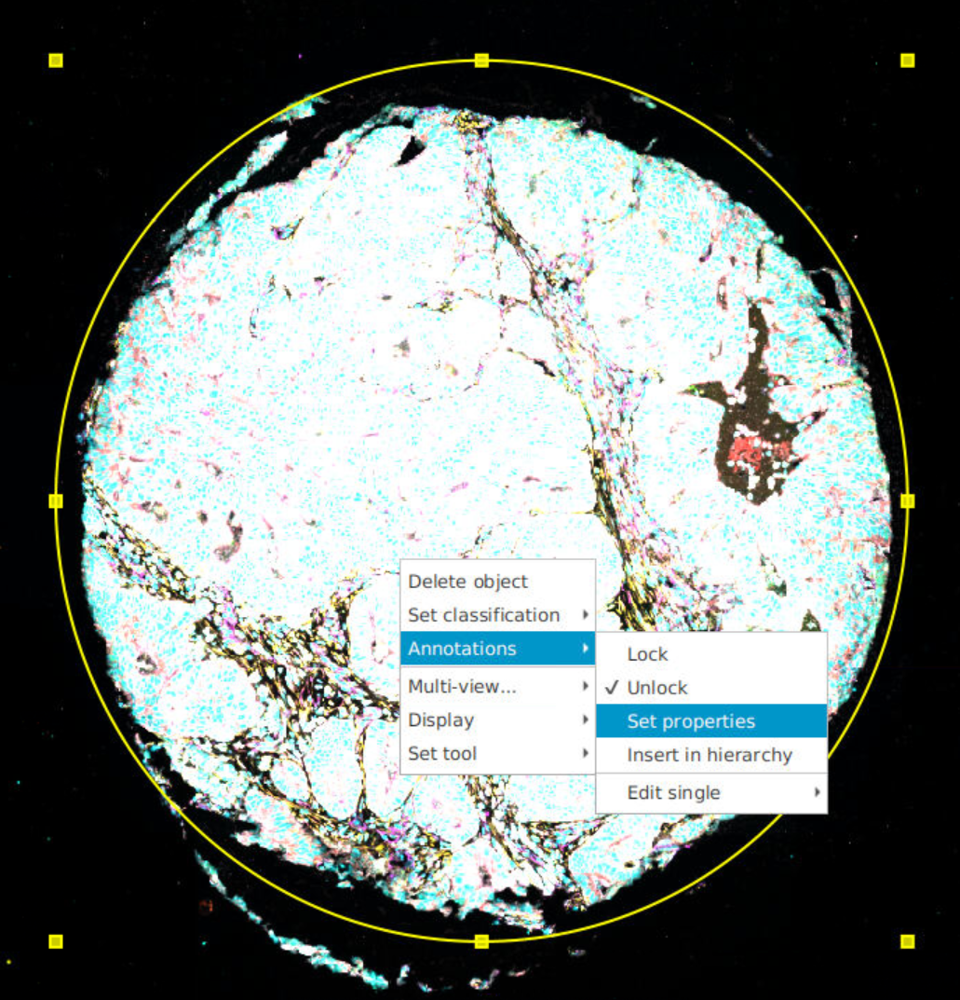

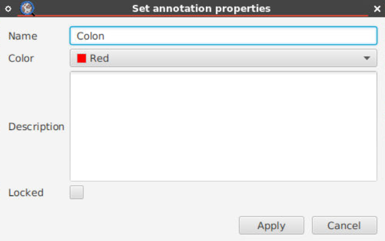

Going forward, keep track of the names of the image and annotations set in QuPath, as these will be used in the next steps. If any of these have spaces in their names, refer to their names **"in quotes"**.

### Cell segmentation

Run the [my_stardist.groovy](./scripts/my_stardist.groovy) script with its stardist model using the "QuPath_Segmentation" widget. Pixel size resolution from the source image needs to be provided into the script.

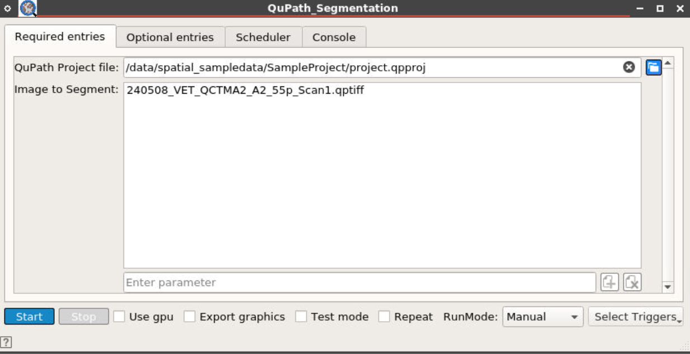

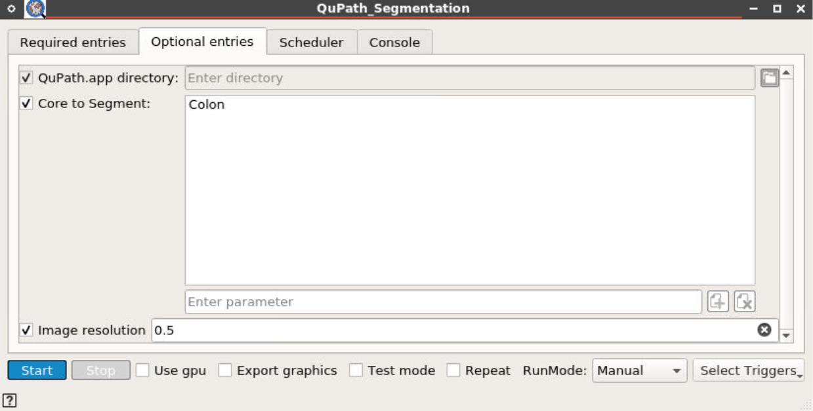

```bash
### ENVIRONMENT VARIABLES REQUIRED:
# image_to_segment=<image name in QuPath project to segment>
# core_to_segment=<annotation name in QuPath project's image>
# resolution=<image resolution (e.g., 0.5, 0.27)>

QuPath script -p <QuPath project file> my_stardist.groovy
```

Outputs are segmented cells placed on the QuPath project image.

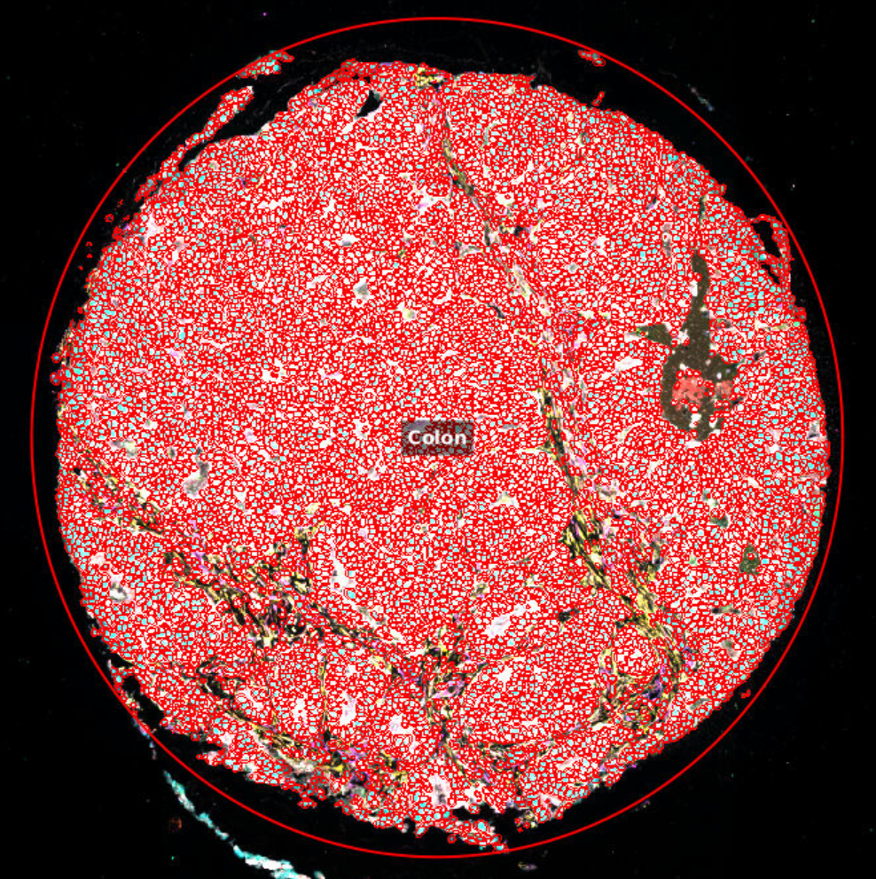

### Export segmentation data to CSV

Run the [export-all-cell-measurements_240829.groovy](./scripts/export-all-cell-measurements_240829.groovy) script to export the cell segmentation data from the image to a CSV file using the "Export Data" widget. Script modified from [Akoya Biosciences](https://github.com/lambrechtslab/Immunity-2024) version of StarDist segmentation.

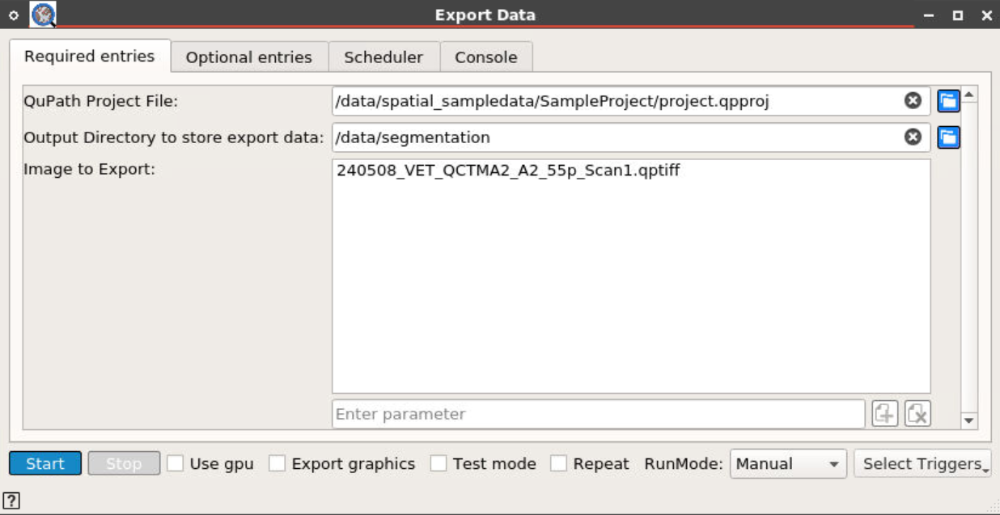

Output is stored in the /data/segmentation/ directory, but you can specify another directory if needed.

```bash
# Adjust file path to stardist_cell_seg_model.pb in script if needed

### ENVIRONMENT VARIABLES REQUIRED:
# image_to_segment=<image name in QuPath project to segment>
# core_to_segment=<annotation name in QuPath project's image>

QuPath script -p <QuPath project file> export-all-cell-measurements_240829.groovy
```
Expected output file is all-cell-measurements.csv, containing metrics for each segmented cell in the QuPath project's image.

### Cell clustering and plots via notebook

Use the [BWBQuPathClustering.ipynb](./scripts/BWBQuPathClustering.ipynb) notebook to use the exported segmentation data to perform unsupervised clustering of cell types using the Leiden algorithm and visualizing the clustering results as Uniform Manifold Approximation and Projections (UMAP) and heatmaps. Inside the notebook, adjust the file path to all-cell-measurements.csv. Set QuPath project image's core/annotation name in the code block `df = df[df['Parent'] == '<segmented annotation/core name>']` if you do not want cluster all regions/annotations in the image.

Run all cells in the notebook to execute the analysis.

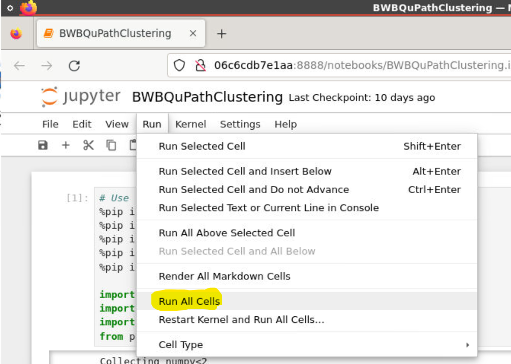

Expected output file is located in the clustering output folder /clustering/leiden_clustering_export.csv (output directory can be changed in the widget entries), containing cell clustering labels and colors for each cell. Additional outputs for the heatmap and UMAP are stored in the cluster_plots/ folder.

### Import cell clustering data back onto QuPath

Run [import_clusters.groovy](./scripts/import_clusters.groovy) to import cell clustering data back into QuPath using the "Import_Cluster_Data" widget. Once finished, QuPath can show the cells with colormaps/masks on the image. Source of the script is inspired from an [image.sc post from Mike Nelson](https://forum.image.sc/t/there-and-back-again-qupath-cytomap-cluster-analysis/43352/2). Adjustments inside the script could be required to match the equivalent of `def folder = new File("/data/clustering_data_export")` for leiden_clustering_export.csv.

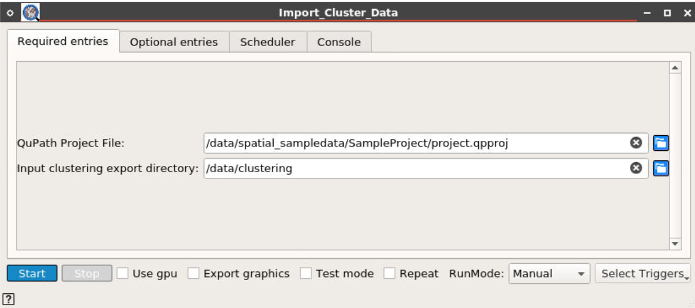

```bash
QuPath script -p <QuPath project file> import_clusters.groovy
```

Outputs are cluster-colored cells on the QuPath project image.

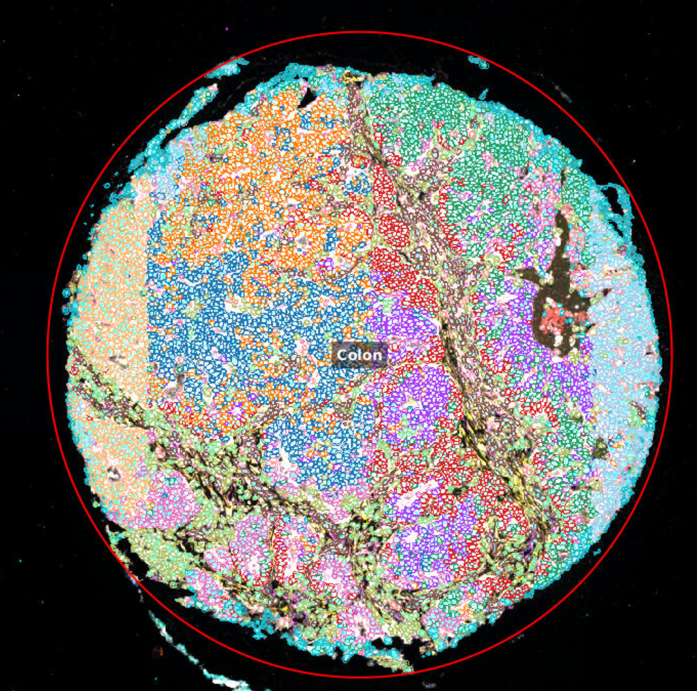

## Raw data files and image dataset

[](https://doi.org/10.5281/zenodo.15825670)

Raw data files associated with the paper "Graphical and Interactive Spatial Proteomics Image Analysis Workflow" are provided on a [Zenodo dataset](https://doi.org/10.5281/zenodo.15825670). DOI is also provided above.

The data files are inside a zip file, the contents of the zip file is listed below:

```
Bwb_SpatialProteomics_TMA_rawfiles/
├─ 240508_VET_QCTMA2_A2_55p_Scan1.qptiff
├─ BWBQuPathClustering.ipynb
├─ clustering_data_export/
│  ├─ leiden_clustering_export.csv
├─ paper_testdata/
│  ├─ classifiers/
│  │  ├─ classes.json
│  ├─ data/
│  │  ├─ 1/
│  │  │  ├─ server.json
│  │  │  ├─ data.qpdata
│  │  │  ├─ summary.json
│  │  │  ├─ thumbnail.jpg
│  ├─ project.qpproj
│  ├─ project.qpproj.backup
├─ testdata_segmentation/
│  ├─ test_image-cell-measurements.csv
```

### Provided image file

There is one spatial proteomics image file named 240508_VET_QCTMA2_A2_55p_Scan1.qptiff. This is a tissue microarray (TMA) stained by high-plex immunohistochemistry. The TMA contains 8 tissue cores, numbered and labeled in the image below as follows:

1. Merkel Cell Carcinoma (MCC)
2. Tonsil
3. Tonsil
4. Breast Carcinoma
5. Squamous cell carcinoma (lung)
6. Hepatocellular carcinoma (HCC - liver)
7. Lung carcinoid
8. Colon cancer

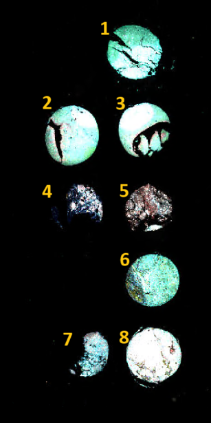

### Workflow outputs

The remaining files and directories in the dataset were generated from running the workflow on one of the cores. The selected core (#6, HCC) was annotated on QuPath and named "Test Core" in its properties.

#### paper_testdata/

The QuPath project folder generated for the TMA image. From the project.qpproj file, the core's segmentation and colored clustering results (generated at the end of the workflow) are shown in the project image.

#### testdata_segmentation/test_image-cell-measurements.csv

The output csv file from running export-all-cell-measurements_240829.groovy on the core. Renamed in post-processing from the default all-cell-measurements.csv name, and placed in its own directory.

#### BWBQuPathClustering.ipynb

A copy of the workflow's Jupyter Notebook; this version has cell block outputs when running the cell segmentation on this core inside the notebook. UMAP and heatmap are shown.

#### clustering_data_export/leiden_clustering_export.csv

The output at the final step of the Jupyter Notebook, containing the cell clustering results for the image core. This file is used in the import_clusters.groovy script.

## References

[1]
Bankhead, P. et al. QuPath: Open source software for digital pathology image analysis. Scientific Reports (2017).
https://doi.org/10.1038/s41598-017-17204-5

[2]
Uwe Schmidt, Martin Weigert, Coleman Broaddus, and Gene Myers.
Cell Detection with Star-convex Polygons.
International Conference on Medical Image Computing and Computer-Assisted Intervention (MICCAI), Granada, Spain, September 2018.

## Biodepot-workflow-builder (Bwb)

All graphical workflows are implemented in the Bwb platform. To learn more about the Bwb platform, please refer to https://github.com/BioDepot/BioDepot-workflow-builder

Biodepot training portal: https://biodepot.github.io/training/
